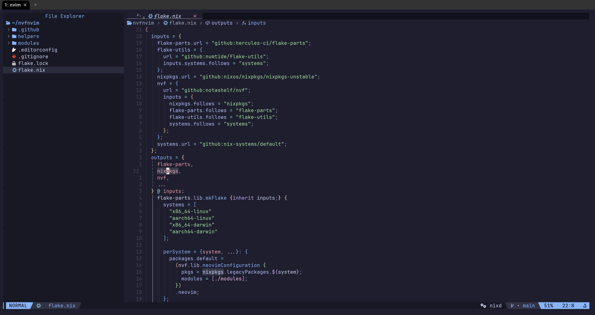

<!-- markdownlint-disable-file MD013 -->

# nvfnvim

Modular, configurable, reproducible and easy to use personal Neovim
configuration in Nix using [nvf](https://github.com/NotAShelf/nvf)

<!--toc:start-->

- [nvfnvim](#nvfnvim)
  - [Quickstart using `nix run`](#quickstart-using-nix-run)
  - [Plugins](#plugins)
    - [Completion](#completion)
    - [Debugging](#debugging)
    - [Diagnostics](#diagnostics)
    - [Editor(General)](#editorgeneral)
    - [Format](#format)
    - [UI](#ui)
  - [Language support](#language-support)
    - [bash](#bash)
    - [lua](#lua)
    - [markdown](#markdown)
    - [nix](#nix)
  - [Other ways of consuming this package](#other-ways-of-consuming-this-package)
    - [Run as a standalone flake](#run-as-a-standalone-flake)
    - [Run as a standalone flake with custom modules](#run-as-a-standalone-flake-with-custom-modules)

<!--toc:end-->



## Quickstart using `nix run`

```sh
nix run --extra-experimental-features nix-command --extra-experimental-features flakes github:venkyr77/nvfnvim
```

also see,
[Other ways of consuming this package](#other-ways-of-consuming-this-package)

## Plugins

### Completion

| Plugin                                            | Completion Source                                          |
| ------------------------------------------------- | ---------------------------------------------------------- |
|                                                   | [cmp-buffer](https://github.com/hrsh7th/cmp-buffer)        |
| [nvim-cmp](https://github.com/hrsh7th/cmp-buffer) | [cmp_luasnip](https://github.com/saadparwaiz1/cmp_luasnip) |
|                                                   | [cmp-nvim-lsp](https://github.com/hrsh7th/cmp-nvim-lsp)    |
|                                                   | [cmp-path](https://github.com/hrsh7th/cmp-path)            |

### Debugging

| Plugin                                               |
| ---------------------------------------------------- |
| [nvim-dap](https://github.com/mfussenegger/nvim-dap) |

### Diagnostics

| Plugin                                                 |
| ------------------------------------------------------ |
| [nvim-lint](https://github.com/mfussenegger/nvim-lint) |

### Editor(General)

| Plugin                                                                | Usage                                                                   |
| --------------------------------------------------------------------- | ----------------------------------------------------------------------- |
| [auto-save.nvim](https://github.com/pocco81/auto-save.nvim)           | For buffer auto save                                                    |
| [catppuccin/nvim](https://github.com/catppuccin/nvim)                 | Colorscheme                                                             |
| [fzf-lua](https://github.com/ibhagwan/fzf-lua)                        | For fuzzy finding(buffers, lsp code actions, references, etc..)         |
| [gitsigns.nvim](https://github.com/lewis6991/gitsigns.nvim)           | For git support                                                         |
| [guess-indent.nvim](https://github.com/NMAC427/guess-indent.nvim)     | Indentation style detection                                             |
| [LuaSnip](https://github.com/L3MON4D3/LuaSnip)                        | For snippet support                                                     |
| [neo-tree.nvim](https://github.com/nvim-neo-tree/neo-tree.nvim)       | Filetree                                                                |
| [nvim-autopairs](https://github.com/windwp/nvim-autopairs)            | For autopair support                                                    |
| [nvim-treesitter](https://github.com/nvim-treesitter/nvim-treesitter) | Tree-sitter based highlighting, indentation, and folding                |
| [smartyank.nvim](https://github.com/ibhagwan/smartyank.nvim)          | Highlight yanked text, use OSC52 to copy to the terminal host clipboard |
| [telescope.nvim](https://github.com/nvim-telescope/telescope.nvim)    | Highly extendable fuzzy finder over lists(files, live grep, etc..)      |

### Format

| Plugin                                                   |
| -------------------------------------------------------- |
| [conform.nvim](https://github.com/stevearc/conform.nvim) |

### UI

| Plugin                                                                          | Usage                                                                        |
| ------------------------------------------------------------------------------- | ---------------------------------------------------------------------------- |
| [bufferline.nvim](https://github.com/akinsho/bufferline.nvim)                   | Tabline                                                                      |
| [dressing.nvim](https://github.com/stevearc/dressing.nvim)                      | For overriding `vim.ui.select` and `vim.ui.input` with `fzf-lua`             |
| [indent-blankline.nvim](https://github.com/lukas-reineke/indent-blankline.nvim) | Indent guide                                                                 |
| [lualine.nvim](https://github.com/nvim-lualine/lualine.nvim)                    | Statusline                                                                   |
| [mini.indentscope](https://github.com/echasnovski/mini.indentscope)             | Indent guide                                                                 |
| [noice.nvim](https://github.com/folke/noice.nvim)                               | Replaces the UI for messages, cmdline, and popup menu                        |
| [nvim-notify](https://github.com/rcarriga/nvim-notify)                          | Notification manager                                                         |
| [rainbow-delimiters.nvim](https://github.com/HiPhish/rainbow-delimiters.nvim)   | Rainbow parantheses using Tree-sitter                                        |
| [todo-comments.nvim](https://github.com/folke/todo-comments.nvim)               | To highlight and search for todo comments ike `TODO`, `HACK`, `BUG`          |
| [vim-illuminate](https://github.com/RRethy/vim-illuminate)                      | To highlight other uses of the word under cursor (using LSP, or Tree-sitter) |

## Language support

### bash

| Functionality           | Package(s)                                                               |
| ----------------------- | ------------------------------------------------------------------------ |
| Language Server(s)      | [bash-language-server](https://github.com/bash-lsp/bash-language-server) |
| Diagnostics provider(s) | [shellcheck](https://github.com/koalaman/shellcheck)                     |
| Formatter(s)            | [shfmt](https://github.com/patrickvane/shfmt)                            |

### lua

| Functionality            | Package(s)                                                                                                                |
| ------------------------ | ------------------------------------------------------------------------------------------------------------------------- |
| Language Server(s)       | [lua-language-server](https://github.com/LuaLS/lua-language-server)                                                       |
| Diagnostics providers(s) | [lua-language-server](https://github.com/LuaLS/lua-language-server)(LSP), [luacheck](https://github.com/mpeterv/luacheck) |
| Formatter(s)             | [stylua](https://github.com/JohnnyMorganz/StyLua)                                                                         |

### markdown

| Functionality            | Package(s)                                                             |
| ------------------------ | ---------------------------------------------------------------------- |
| Diagnostics providers(s) | [markdownlint-cli2](https://github.com/DavidAnson/markdownlint-cli2)   |
| Formatter(s)             | [denofmt](https://github.com/denoland/deno/blob/main/cli/tools/fmt.rs) |

### nix

| Functionality            | Package(s)                                                                                          |
| ------------------------ | --------------------------------------------------------------------------------------------------- |
| Language Server(s)       | [nixd](https://github.com/nix-community/nixd)                                                       |
| Diagnostics providers(s) | [nixd](https://github.com/nix-community/nixd)(LSP), [statix](https://github.com/oppiliappan/statix) |
| Formatter(s)             | [alejandra](https://github.com/kamadorueda/alejandra)                                               |

### terraform

| Functionality            | Package(s)                                                     |
| ------------------------ | -------------------------------------------------------------- |
| Language Server(s)       | [terraform-ls](https://github.com/hashicorp/terraform-ls)      |
| Diagnostics providers(s) | [terraform-ls](https://github.com/hashicorp/terraform-ls)(LSP) |
| Formatter(s)             | [terraform-ls](https://github.com/hashicorp/terraform-ls)(LSP) |

### typescript

| Functionality            | Package(s)                                                                                                  |
| ------------------------ | ----------------------------------------------------------------------------------------------------------- |
| Language Server(s)       | [typescript-language-server](https://github.com/typescript-language-server/typescript-language-server)      |
| Diagnostics providers(s) | [typescript-language-server](https://github.com/typescript-language-server/typescript-language-server)(LSP) |
| Formatter(s)             | [prettier](https://github.com/prettier/prettier)                                                            |

## Other ways of consuming this package

### Run as a standalone flake

A simple standalone flake that makes this package as default

```nix
{
  inputs = {
    flake-parts.url = "github:hercules-ci/flake-parts";
    nixpkgs.url = "github:nixos/nixpkgs/nixpkgs-unstable";
    nvfnvim = {
      url = "github:venkyr77/nvfnvim";
      inputs = {
        flake-parts.follows = "flake-parts";
        nixpkgs.follows = "nixpkgs";
      };
    };
  };

  outputs = {
    nvfnvim,
    flake-parts,
    ...
  } @ inputs:
    flake-parts.lib.mkFlake {inherit inputs;} {
      systems = [
        "x86_64-linux"
        "aarch64-linux"
        "x86_64-darwin"
        "aarch64-darwin"
      ];

      perSystem = {system, ...}: {
        packages = {inherit (nvfnvim.packages.${system}) default;};
      };
    };
}
```

and then run using `nix run` by,

```sh
nix run --extra-experimental-features nix-command --extra-experimental-features flakes .
```

### Run as a standalone flake with custom modules

You can also just import the
[modules](https://github.com/venkyr77/nvfnvim/tree/main/modules) and add your
own modules

A standlone flake that uses modules from
[nvfnvim/modules](https://github.com/venkyr77/nvfnvim/tree/main/modules) and
allows for addition of more modules

```nix
{
  inputs = {
    flake-parts.url = "github:hercules-ci/flake-parts";
    flake-utils = {
      url = "github:numtide/flake-utils";
      inputs.systems.follows = "systems";
    };
    nixpkgs.url = "github:nixos/nixpkgs/nixpkgs-unstable";
    nvf = {
      url = "github:notashelf/nvf";
      inputs = {
        flake-parts.follows = "flake-parts";
        flake-utils.follows = "flake-utils";
        nixpkgs.follows = "nixpkgs";
        systems.follows = "systems";
      };
    };
    nvfnvim = {
      flake = false;
      url = "github:venkyr77/nvfnvim";
    };
    systems.url = "github:nix-systems/default";
  };

  outputs = {
    flake-parts,
    nixpkgs,
    nvf,
    nvfnvim,
    ...
  } @ inputs:
    flake-parts.lib.mkFlake {inherit inputs;} {
      systems = [
        "x86_64-linux"
        "aarch64-linux"
        "x86_64-darwin"
        "aarch64-darwin"
      ];

      perSystem = {system, ...}: {
        packages.default =
          (nvf.lib.neovimConfiguration {
            pkgs = nixpkgs.legacyPackages.${system};
            modules = [
              "${nvfnvim}/modules" # modules from https://github.com/venkyr77/nvfnvim/tree/main/modules

              # include your modules
              # ./mymodule

              # or just
              {
                config.vim = {
                  # any option from https://notashelf.github.io/nvf/options.html
                  # for ex
                  dashboard.alpha.enable = true;
                };
              }
            ];
          })
          .neovim;
      };
    };
}
```

and then run using `nix run` by,

```sh
nix run --extra-experimental-features nix-command --extra-experimental-features flakes .
```
